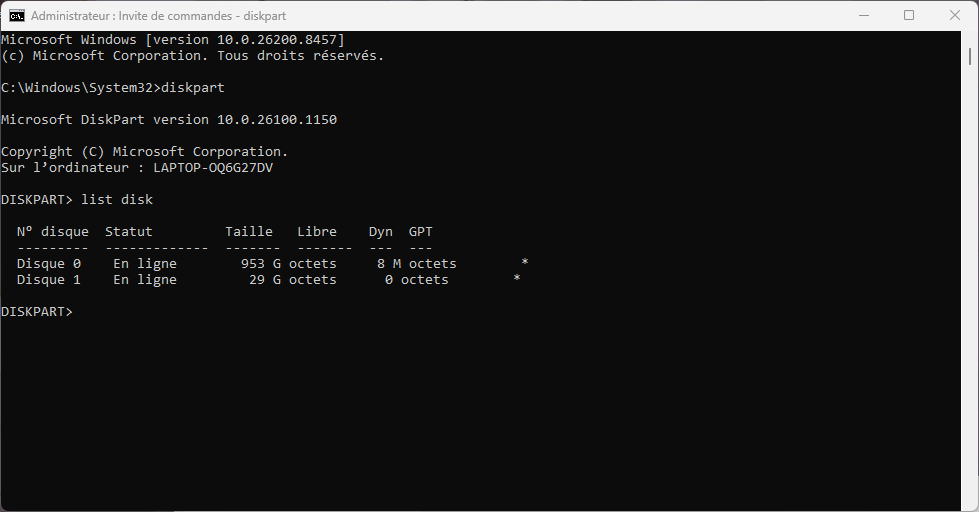
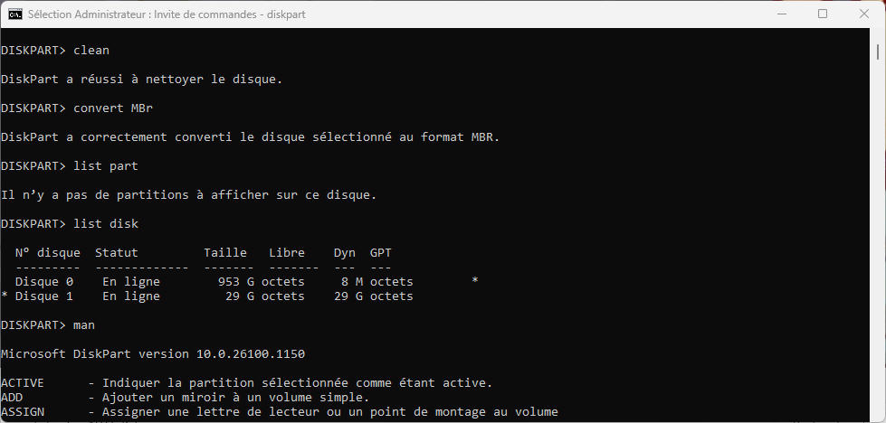
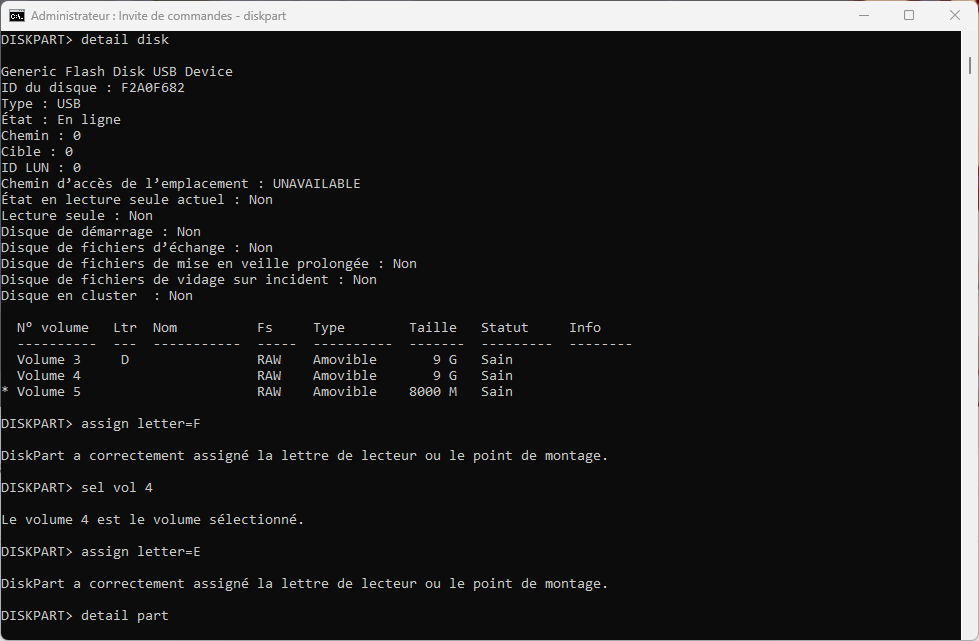
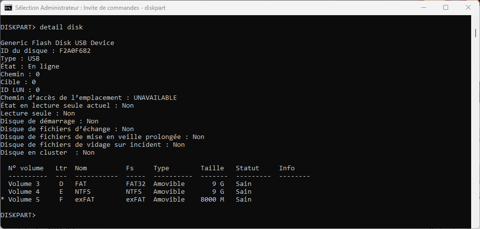
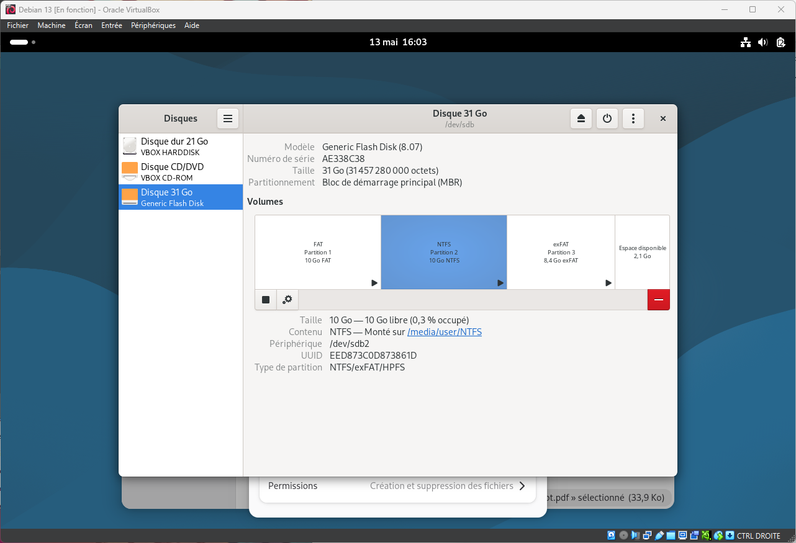

# Challenge A02E06 - MBR/GPT

**Consignes :**  
Sauvegardez les données d’une clé USB, puis tentez de :  
- convertir sa table de partitions de MBR à GPT (ou l’inverse) à l’aide de l’utilitaire DiskPart (depuis une VM Windows, si vous êtes sous MacOS)
- créer plusieurs partitions sur cette clé et tester de les formater avec différents systèmes de fichiers : NTFS, FAT32 et ExFAT
- testez la compatibilité avec les différents systèmes d’exploitation (en connectant la clé USB sur des VMs VirtualBox)  

## Convertion de la table de partition en MBR  
On ouvre l'invite de commande en administrateur et on ouvre `Diskpart`.  
On détermine d'abord le format de la table de partition de notre clée USB, pour ça on fait un `list disk`.  

On voit ici que le disque 1 qui est notre clé UCB est en GPT à l'étoile en bout de ligne.

on va faire la suite de commades suivante : 
`sel disk 1` : on selectionne le disque 1;  
`clean`  : on efface toutes les infos du disque;  
`convert mbr` : on converti la  table de partition en MBR  

On fait un nouveau `list disk` pour vérifier

 On voit que le disque 1 n'a plus l'étoile, il est donc en MBR.  
 
## Création de plusieurs partitions en format NTFS, FAT32 et ExFAT  
On va d'abord créer 2 partitions de 10Go et 1 de 8Go avec les commandes : `create part primary size 10000` et `create part primary size 8000`.  
On vérifie la création des partitions et leur format avec `detail disk` :
  
On voit que 3 partitions au format RAW dont 2 sans point de montage ont été crées. On va donc leur assigné une lettre et les formater dans trois formats différents avec les commandes suivantes :  
`assign letter=F` pour assigner un point de montage F: au volume 5 sélectionné;  
`sel vol 4` On sélectionne le volume 4;  
`assign letter=E` Pour lui assigner le point de montage E:  

`format fs=ntfs label=NTFS quick` On formate le volume en NTFS;  
`sel vol 3` On selectionne le volume 3;  
`format fs=FAT32 label=FAT quick` On le formate en FAT32;  
`sel vol 5` On selectionne le volume 5;  
`format fs=exfat label=exFAT quick` On le formate en ExFAT;  

On refait un `detail disk`

On voit que les partitions ont bien été formatées.

## Test de la compatibilité avec d'autres OS
Oncopie un fichier sur chaque partition.  

Pour pouvoir utiliser la clé USB il faut l'activer dans les paramètres USB de la VM.
![Paramètrages de la clé USB dans VBox](USB.png "USB"

On allume ensuite la VM; On voit que les 3 partitions sont disponibles, les fichiers sont copiables dans le système.

